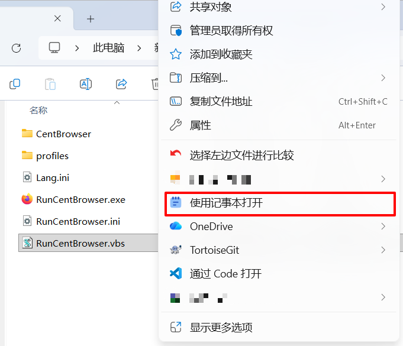

# NotepadReplacer

[English](README.md) | [简体中文](README.zh-CN.md)

[](https://nightly.link/benzBrake/NotepadReplacer/workflows/nightly/master/NotepadReplacer-nightly)


NotepadReplacer is a Windows Notepad replacement tool. It forwards calls to `notepad.exe` to a text editor selected by the user and adds an “Open with Notepad” context-menu command to File Explorer on Windows 11.

The installer handles target-program selection, removal of the Microsoft Store version of Notepad, system configuration, context-menu deployment, and uninstall cleanup. `NotepadReplacerLauncher` is the lightweight component that forwards process calls; it is not the name of the project itself.



## Features

- Forward calls to `notepad.exe` to a specified `.exe` program.
- Deploy the Launcher for the system architecture; on 64-bit systems, configure both 32-bit and 64-bit IFEO registry views.
- Escape and forward valid arguments according to Windows command-line rules, including spaces, quotes, and backslashes.
- Add an “Open with Notepad” command to the top-level File Explorer context menu on 64-bit Windows 11.
- Open multiple selected files from the context menu in one operation.
- Provide Chinese and English installer interfaces, with rollback on installation failure and cleanup during uninstall.

## Installation and Usage

1. Run `NotepadReplacerSetup.exe` as an administrator.
2. Select the executable file that should replace Windows Notepad, such as the `.exe` file of another text editor.
3. Confirm removal of the Microsoft Store version of Notepad and wait for installation to finish.
4. Files opened through `notepad.exe` will then be forwarded to the selected program. On supported Windows 11 systems, you can also use “Open with Notepad” from the File Explorer context menu.

The installation directory is fixed at `Program Files\NotepadReplacer` on the system drive. The target program path is stored at:

```text
HKEY_LOCAL_MACHINE\SOFTWARE\NotepadReplacer\TargetPath
```

### Before You Install

- The installer requires administrator privileges.
- Installation removes the Microsoft Store version of Notepad installed for the current user and removes its corresponding provisioned package from the system.
- Uninstalling NotepadReplacer **does not automatically restore the Microsoft Store version of Notepad**. Reinstall it manually from the Microsoft Store if needed.
- The selected replacement program must remain at its original path. Forwarding and the context menu will not work correctly if the file is moved or deleted.
- If an IFEO Debugger configuration for `notepad.exe` already exists and does not belong to this project, installation stops to avoid overwriting it.
- The complete x64 installation requires 64-bit Windows 11 (Build 22000 or later). Installation rolls back if the context-menu package cannot be registered.

## How It Works

NotepadReplacer consists of the installation/configuration flow, a process-forwarding component, and Windows 11 context-menu components:

| Component | Responsibility |
| --- | --- |
| `NotepadReplacerSetup.exe` | Selects the target program, removes Store Notepad, deploys files, writes IFEO and the target path, and handles rollback and uninstall |
| `NotepadReplacerLauncher` | Receives IFEO Debugger arguments, removes the `notepad.exe` path added by Windows, then forwards the remaining arguments to the target program |
| `NotepadReplacerContextMenu.dll` | Implements the Windows 11 File Explorer command and passes selected files to the configured target program |
| `NotepadReplacer.msix` | Registers the context-menu command and COM component through the `windows.fileExplorerContextMenus` extension |

The installer writes the architecture-specific Launcher to the following IFEO configuration:

```text
HKLM\SOFTWARE\Microsoft\Windows NT\CurrentVersion\Image File Execution Options\notepad.exe
```

The call flow is:

```text
An application or command line calls notepad.exe
  -> Windows starts NotepadReplacerLauncher through IFEO
  -> The Launcher removes the extra IFEO arguments
  -> The Launcher creates the selected target process and exits immediately
```

The context menu does not go through `notepad.exe`. It reads the target path saved by the installer, starts the target program directly, and passes all selected files to it.

## Building from Source

### Requirements

- Visual Studio 2022 with the “Desktop development with C++” workload
- CMake 3.21 or later
- Windows 10/11 SDK
- Inno Setup 6 (only required to build the installer)

### Build the Program Components

Run the build script to generate the x64 Launcher, x64 context-menu DLL, and x86 Launcher required by the installer:

```powershell
powershell -ExecutionPolicy Bypass -File .\build.ps1
```

The script builds the Release configuration and uses the static MSVC runtime by default. Use `-Configuration Debug` for another configuration, or `-DynamicRuntime` to use the dynamic runtime (the target system must have the corresponding Visual C++ Runtime installed).

All build outputs are written to `dist`: the x64 and x86 CMake build directories are `dist\x64` and `dist\x86`, respectively, and the context-menu package is located at `dist\context-menu-package`.

To build only the Launcher, disable the Windows 11 context-menu component:

```powershell
cmake -S . -B dist/x64 -G "Visual Studio 17 2022" -A x64 -DNOTEPADREPLACER_BUILD_CONTEXT_MENU=OFF
```

Run the tests:

```powershell
ctest --test-dir dist/x64 -C Release --output-on-failure
```

### Build the Installer

After completing the x64 and x86 Release builds, run:

```powershell
powershell -ExecutionPolicy Bypass -File installer/build-installer.ps1
```

The script performs the following steps:

1. Checks for the x86 and x64 Launchers and the x64 context-menu DLL.
2. Uses the Windows SDK `MakeAppx.exe` to create the MSIX package.
3. Signs the MSIX with `SignTool.exe` and exports the certificate required during installation.
4. Calls Inno Setup's `ISCC.exe` to generate the final installer.

The output file is:

```text
dist\NotepadReplacerSetup.exe
```

Before building the installer for the first time, generate a fixed self-signed certificate locally:

```powershell
powershell -ExecutionPolicy Bypass -File installer/New-SigningCertificate.ps1
```

The generated PFX, password, and Base64 files are placed in `.certificates`, which is ignored by Git. `build-installer.ps1` prefers the local `NotepadReplacer.pfx` and `NotepadReplacer.password`; if they are unavailable, it uses the `WINDOWS_CERTIFICATE` (Base64 PFX) and `WINDOWS_CERTIFICATE_PASSWORD` environment variables.

For GitHub Actions, save the contents of `.certificates/NotepadReplacer.pfx.base64` as the repository secret `WINDOWS_CERTIFICATE`, and the contents of `.certificates/NotepadReplacer.password` as `WINDOWS_CERTIFICATE_PASSWORD`. Local and remote builds will then use the same certificate.

When installing the context menu, the installer adds the MSIX signing certificate to the local `TrustedPeople` certificate store and removes the certificate during uninstall.

## Troubleshooting

If registration of the Windows 11 context menu fails, the installation rolls back. Detailed PowerShell and AppX errors are recorded at:

```text
%ProgramData%\NotepadReplacer\context-menu.log
```

The Launcher is a Windows subsystem program and does not display a console window. It exits immediately after creating the target process; it does not wait for the target program to finish.

## License

This project is licensed under the [GNU General Public License v3.0 or later](LICENSE) and is subject to the [GPLv3 Section 7 Additional Terms](ADDITIONAL-TERMS.md). You may use, study, modify, and distribute this software. When distributing the original or a modified version, you must provide the complete corresponding source code under the GPL, retain applicable notices, and must not distribute GPL-covered derivative works as closed source.

The Additional Terms require retaining the statement that the original materials were AI-assisted and developed through vibe coding, and prohibit misrepresenting the original materials as having been created entirely through traditional manual programming, without AI, or as “non-vibe coding.” Modifiers may truthfully describe the development methods used for their independently created portions.

`replacer.ico` and `installer/logo.png` are third-party assets and are not relicensed by the statements above. Redistributors must comply with the original rights holders' licenses or replace these assets with materials they are authorized to distribute.

## Image Sources

`replacer.ico` and `installer/logo.png` are sourced from [Iconbuddy](https://iconbuddy.com/).
